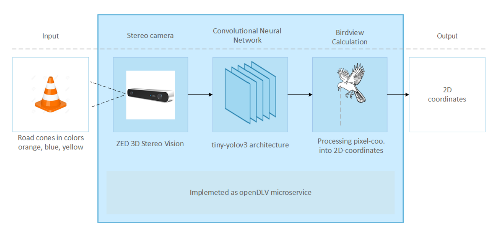
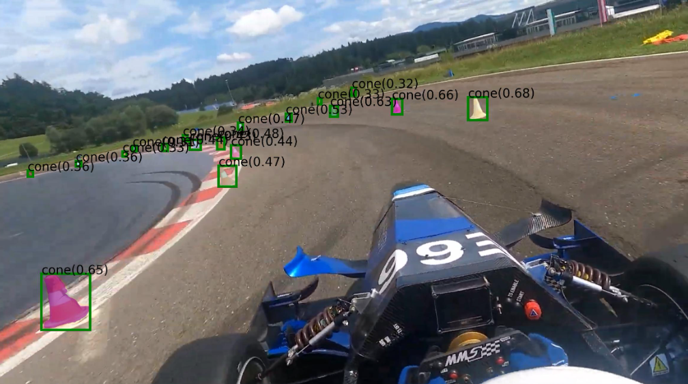

# Introduction

Within the wider Formula Student competition, Formula Student Driverless
represents the autonomous category, where student teams develop and
build a single-seater, open-wheel race car capable of navigating a track
without human control. To achieve this, driverless vehicles rely on
vision systems to act as their eyes, enabling them to perceive their
surroundings and make decisions based on visual input. As such, the
performance of a Formula Student driverless vehicle can be largely
attributed to the strength and quality of these vision systems. The
majority of vision systems can be fitted into three categories: Light
Detection And Ranging (LiDAR), camera (utilizing computer vision), and
LiDAR-camera fusion, all with their own benefits and pitfalls. LiDAR has
traditionally been regarded as the most accurate, but also the most
expensive. In contrast, camera systems offer a much more cost-effective
alternative, but historically suffer from lower perception accuracy.
However, advancements in neural networks and machine learning algorithms
in recent years have heavily improved camera-based perception, leading
to an increase in popularity among student teams.

Monash Motorsport's (MMS) M25 vehicle currently uses a Baraja LiDAR for
its perception stack. This system comes with significant penalties in
weight, price and power consumption, as well as limitations with colour
costing and cone detection accuracy. This project aims to explore
camera-based alternatives to the current system to reduce these
disadvantages without heavily compromising on object detection accuracy
on track. This project will focus mainly on the software implementation
of such a system, but will also include a hardware prototype to evaluate
the feasibility of the system in practice.

The main objectives of this project are as follows:

- Design and prototype a camera-only vision system specific to the
  Formula Student Driverless problem.

- Integrate the system with the rest of the MMS autonomous pipeline.

- Test the feasibility of the system on track, in real time.

- Evaluate the system against the current LiDAR-only system (see
  Section [3](#sec:methodology){reference-type="ref"
  reference="sec:methodology"}).

Through design, prototyping, testing and evaluation, this project will
assess the feasibility of a camera-based vision system and allow Monash
Motorsport to make better informed decisions on future vehicle designs.
On a broader scale, the outcomes of this research will contribute to the
discourse regarding camera vision in autonomous vehicles, and how it
compares to the more established LiDAR approach.

# Literature Review

A research report by student team KA-RaceIng [@karaceing] details their
autonomous pipeline that led to multiple competition wins in 2021. The
report details a computer vision model, powered by three front-facing
RGB mono cameras used in tandem to provide a field of view (FOV) of
$180^\circ$. This system allows for the classification of specific cone
types based on size and colour, something that is not achievable with
the Baraja LiDAR. Additionally, the report highlights the importance of
innovation in Formula Student, as the event is an engineering design
competition at its core. Whilst KA-RaceIng opted out of using their
three-camera system on competition day, being able to showcase
creativity and evaluate multiple approaches gained them additional
points during their 2021 campaign.

::: wrapfigure
R0.5 {width="50%"}
:::

Another student team paper, authored by members of Chalmers Formula
Student [@chalmers] details their experience working with a camera-based
vision system. The software process involves manually annotating frames
and using them to train a tiny-sized YOLOv3-based (You Only Look Once)
neural network to run on track. It was noted that a full-sized YOLOv3
model was also trained, but maintained the same flaws as its smaller
counterpart whilst also doubling execution time. Two approaches were
used to calculate cone positions: camera depth and cone size. The
Stereolabs ZED camera automatically detects the distance to the cones,
whereas the size of detected cones were compared to the known sizes of
the cones in Formula Student competition. Through testing, it was
concluded that the camera depth method worked well at close range, but
the cone size method was more accurate at longer distances. By combining
the two approaches, Chalmers FS were able to develop a robust algorithm
with much less error. However, this implementation puts the system at
risk if Formula Student rules were to change. If the sizes of the cones
used on track changed, the YOLOv3 neural network would estimate cone
positions based on an incorrect assumption, leading to inaccurate
results.

In terms of available models, @zhao identifies the Grounded-Segment
Anything Model [@grounded_sam] as an all-purpose object detector
suitable for autonomous driving. Grounded-SAM is a combination of
Grounding DINO [@dino] and Segment Anything Model [@sam]. First,
Grounding DINO is used to take a text prompt and draw a bounding box
around the object described in the text. Then, SAM is used to create an
exact-pixel mask of the object within the bounding box. Despite this,
the most important information to gather from each image is the
center-point and colour of an object, meaning that the SAM portion of
Grounded-SAM will most likely not be beneficial (masks are less suited
for the Formula Student driverless problem), making Grounding DINO alone
a better option.

However, Grounding DINO cannot simply be run on the vehicle in
real-time. A recent study [@son] describes it as slower than YOLO
models, and therefore unsuitable for real-time use cases. The study
concluded that Grounding DINO is better utilized as a teacher model
which can automatically label training data to train lightweight models
like YOLO. Additionally, using auto-labelled data does not lead to a
degradation in performance when compared to hand-labelled data. By
automating the annotation process, significant amounts of time can be
saved, especially when training with large amounts of data.

Past papers often evaluate the performance of a camera-based vision
system using older versions of YOLO, such as v3 or v5. Whilst the older
YOLO models had issues with poor object detection accuracy, a review of
the YOLO algorithm in the context of autonomous driving [@wei]
demonstrates that the detection accuracy of YOLO has improved
significantly with each new version.

A paper comparing the performance of Convolutional Neural Networks
(CNNs) such as YOLO, and Vision Transformers (ViTs) for the purposes of
real-time autonomous driving [@gupta] concluded that CNNs are generally
faster and more accurate, but perform worse than ViTs in challenging
conditions such as low lighting and occlusions.

However, a white paper detailing the specifics of YOLO11 [@alif], the
latest YOLO version released by Ultralytics, depicts it as one of the
most accurate CNNs to date. With improved convolution-based attention
modules, deeper feature extraction layers, and a new anchor-free
approach, @alif highlights its robustness across different environmental
conditions, minimizing the gap between CNNs and ViTs such as RT-DETRv2
[@rt_detr] in that aspect, whilst maintaining its advantage in
efficiency. While this paper evaluates YOLO11 for vehicle detection,
this project focuses on cone detection. Differences in object size,
shape, and appearance may lead to variations in performance metrics.

# Methodology {#sec:methodology}

The proposed camera-based vision system consists of a set of two
front-facing cameras connected to an onboard computer, running a neural
network-based object detection pipeline to identify cones in front of
the vehicle and provide their pose to M25's path planning section. This
system should be fully integrated into the MMS autonomous pipeline.\

= \[rectangle, rounded corners, minimum width=3cm, minimum
height=1cm,text centered, draw=black, fill=red!30\] = \[rectangle,
minimum width=3cm, minimum height=1cm, text centered, draw=black,
fill=orange!30\] = \[thick,-\>,\>=stealth\]

<figure data-latex-placement="h!">

<figcaption>General camera system overview</figcaption>
</figure>

A key challenge in this project is developing a vision algorithm capable
of fully utilizing a dual-camera setup. The selected hardware for this
purpose is the Basler acA2440-20gc, readily available and within MMS
posession. The Basler comes with a resolution of 5 MP, a default frame
rate of 22.7 FPS, and a $50^\circ$ FOV. Additionally it uses a global
shutter, reducing motion distortion commonly experienced with rolling
shutter cameras. Initially one camera will be used, to simplify setup
and evaluation efforts. If few difficulties are encountered, the system
will be upgraded to include two cameras in a stereo configuration
(requiring the creation of a mount). The camera(s) will be connected to
an onboard NVIDIA Jetson Orin, allowing for CUDA acceleration on neural
networks. If the project maintains its schedule, a mounting rig will be
designed and produced in order to test the system on M25.

To gather training data, a single camera will be fixed to the M25
vehicle and recording during testing sessions, regardless of whether
there is a driver inside or not. If M25 is unavailable, a tripod will be
available to set up at the correct height to simulate vehicle
conditions, and cones will be arranged in different configurations and
with different lighting conditions to collect a wide variety of data.
Once collected, video footage will be split into frames and personally
selected. Chosen frames will be fed into a Grounding DINO model with
prompts to identify different coloured cones. When the bounding boxes
have been obtained, the original frames and the ground truths will be
used to train a CNN-based model to be used on the track. The first
iteration will employ a YOLO11n model for training and testing. This
serves as a baseline, and the final model selection may change based on
key performance metrics such as latency and detection accuracy. 80% of
the data will be fed into the model for training, and 20% will be saved
for testing and validation of the model. The bounding box data will be
used to generate an array of cone poses, which will be sent to the MMS
path planning node.

To evaluate the system's performance, four key metrics will be tracked:
detection accuracy, false positive rate, latency (ms) and floating point
operations per second (FLOPS). The test environment will start with
offline dataset testing, before moving onto controlled on-track testing.
Finally, these metrics will be benchmarked against M25's current LiDAR
vision system. Detection accuracy and false positive rate will directly
compare the capabilities of both systems, whilst latency offers insights
into the system's real-time responsiveness. Finally, FLOPS provides an
unbiased measure of computational load, regardless of hardware
specifics.

For software development, Python will be the initial programming
language, for its compatibility with PyTorch, a library known for its
strong support of custom YOLO models and simple prototyping. If
necessary, a transition to C++ will be carried out in order to integrate
into M25's pre-existing pipeline. Version control and project management
will be facilitated by Git and Bitbucket. Task tracking, issue
management and sprint planning will be handled with Jira to ensure tasks
and milestones remain on schedule.

# Discussion

::: wrapfigure
R0.5 {width="50%"}
:::

Preliminary testing with the Grounding DINO model hosted by Hugging Face
shows promising results. When tested on video footage captured in Monash
Motorsport's Europe campaign in 2024, the model was able to identify
most cones on each image and create accurate bounding boxes around each
cone.

Issues were encountered when dealing with lower quality videos (720p,
360p). On average, only 20 25% of cones were accurately identified on
360p footage. However, it is expected that the chosen camera (Basler
ace) will be able to record at 1080p consistently, given the 5 MP
resolution.

Another issue encountered during preliminary testing was the lack of an
available NVIDIA Graphics Processing Unit (GPU). Without an NVIDIA GPU,
object detection models such as YOLO and Grounding DINO cannot utilize
CUDA acceleration, meaning that the runtime of their algorithms is much
slower. For this reason, it was difficult to test these models whilst
working away from the M25 vehicle.

# Conclusion

This paper presented the concept of a camera-based vision system for a
Formula Student driverless vehicle, in contrast to Monash Motorsport's
current LiDAR-based system. The study conducted showcased the potential
of a camera-based system, and how it can address the limitations of the
LiDAR without compromising on important attributes, like detection
accuracy and false positive rate. A foundation for the proposed system
was created, including hardware requirements, initial software stack
choices, testing techniques and tools.

Future work will involve the steps mentioned in the methodology:
gathering data, annotating, training a lightweight model, and evaluating
its performance both offline and on-track in comparison to the
pre-existing LiDAR system. This research aims to improve Monash
Motorsport's technical knowledge on cameras and computer vision, provide
an alternative vision system for future iterations of MMS vehicle
design, and contribute to the discourse surrounding camera vision in
autonomous vehicles.
